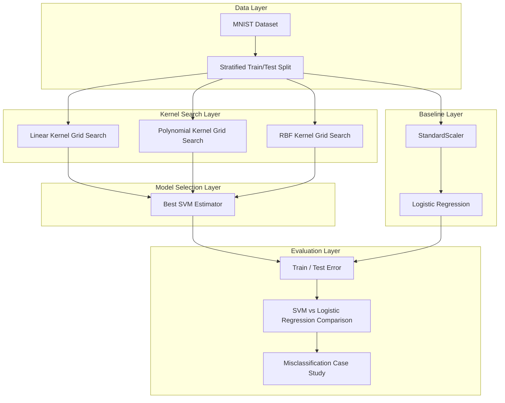
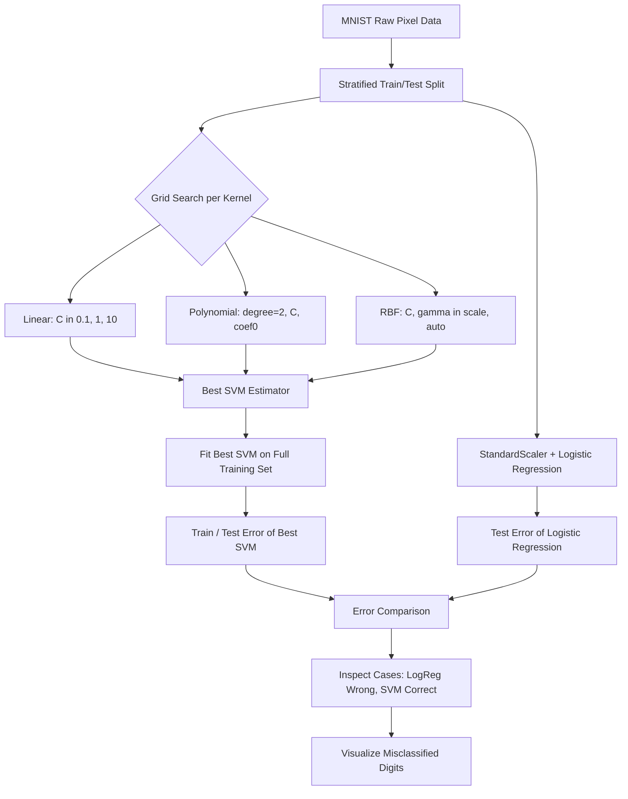

<div align="center">
  
</div>

---

# Optimal SVM Kernel Selection for MNIST Digit Recognition with Logistic Regression Benchmarking

A systematic, GridSearchCV-driven comparison of Linear, Polynomial, and RBF Support Vector Machine kernels for handwritten digit recognition on MNIST, benchmarked against a Logistic Regression baseline to quantify the impact of non-linear decision boundaries on classification accuracy.

<div align="left">

[](https://www.python.org/)
[](https://scikit-learn.org/)
[](#)
[](#)
[](#)
[](https://numpy.org/)
[](https://matplotlib.org/)
[](https://www.openml.org/d/554)
[](https://opensource.org/licenses/MIT)

</div>

## Abstract

Kernel-based Support Vector Machines remain a strong baseline for image classification tasks with non-linear decision boundaries, yet the choice of kernel and its hyperparameters critically determines model performance. This project presents a rigorous, exhaustive comparison of three SVM kernels — Linear, Polynomial (degree 2), and Radial Basis Function (RBF) — on the MNIST handwritten digit dataset, tuned via cross-validated grid search. The best-performing model, an RBF-kernel SVM (C=10, gamma='scale'), is trained end-to-end and benchmarked against a Logistic Regression pipeline with feature standardization. The analysis further inspects specific test cases where Logistic Regression fails but the tuned SVM succeeds, illustrating the practical advantage of non-linear kernels on high-dimensional pixel data.

## Table of Contents

1. [Overview](#overview)
2. [System Architecture](#system-architecture)
3. [Experiment Workflow](#experiment-workflow)
4. [Methodology](#methodology)
   - 4.1 [Kernel Search Space](#41-kernel-search-space)
   - 4.2 [Model Selection via Cross-Validation](#42-model-selection-via-cross-validation)
   - 4.3 [Logistic Regression Baseline](#43-logistic-regression-baseline)
5. [Results and Analysis](#results-and-analysis)
6. [Project Structure](#project-structure)
7. [Usage and Installation](#usage-and-installation)
8. [License](#license)
9. [Author](#author)
10. [Support](#support)

# Overview

Handwritten digit recognition on MNIST is a well-established benchmark for evaluating classical machine learning classifiers on high-dimensional, non-linearly separable pixel data. This project investigates how the choice of SVM kernel shapes the decision boundary and, in turn, generalization performance, before contrasting the best kernel-based model against a purely linear classifier.

The pipeline covers the full experimental cycle:

- Stratified train/test splitting of the MNIST dataset
- Exhaustive, cross-validated hyperparameter search across three SVM kernels (Linear, Polynomial, RBF)
- Selection and full training of the best-scoring SVM configuration
- Training error and test error evaluation of the selected model
- A Logistic Regression baseline trained on standardized pixel features
- Head-to-head error comparison between SVM and Logistic Regression
- Qualitative case study of digits misclassified by Logistic Regression but correctly classified by SVM

---

# System Architecture

The experiment follows a layered pipeline in which raw pixel data is split, fed through a kernel-based hyperparameter search, and independently benchmarked against a linear baseline, with a dedicated analysis layer for error comparison and misclassification inspection.



### Architectural Components

| Layer | Responsibility |
|:---------|:---------------|
| Data Layer | Loading MNIST and producing a stratified, class-balanced train/test split |
| Kernel Search Layer | Cross-validated grid search over Linear, Polynomial, and RBF SVM kernels |
| Model Selection Layer | Selecting the highest cross-validation score across all kernel configurations |
| Baseline Layer | Feature standardization and Logistic Regression training |
| Evaluation Layer | Train/test error computation, cross-model comparison, and qualitative error analysis |

This design isolates kernel selection as an independent experimental stage, which makes it possible to attribute performance differences directly to the geometry of the decision boundary rather than to inconsistent preprocessing or evaluation procedures.

# Experiment Workflow



---

# Methodology

## 4.1 Kernel Search Space

Three kernel families are evaluated, each with its own hyperparameter grid, so that every kernel is given a fair opportunity to reach its best achievable cross-validation score:

```python
param_grid_linear = {'kernel': ['linear'], 'C': [0.1, 1, 10]}
param_grid_poly   = {'kernel': ['poly'], 'C': [0.1, 1, 10], 'degree': [2], 'coef0': [0, 1]}
param_grid_rbf    = {'kernel': ['rbf'], 'C': [0.1, 1, 10], 'gamma': ['scale', 'auto']}
```

- **Linear kernel** — assumes the classes are linearly separable in the original pixel space; used as the simplest decision boundary.
- **Polynomial kernel (degree 2)** — captures low-order, curved interactions between pixel features.
- **RBF kernel** — maps inputs into an infinite-dimensional feature space via a similarity measure controlled by `gamma`, allowing highly flexible, non-linear decision boundaries well suited to unstructured image data.

## 4.2 Model Selection via Cross-Validation

Each kernel's grid is searched with 3-fold cross-validation (`GridSearchCV`, `scoring='accuracy'`), and the single best-scoring configuration across all three kernels is selected, retrained on the full training set, and evaluated on the held-out test set.

## 4.3 Logistic Regression Baseline

A `StandardScaler → LogisticRegression` pipeline is trained on the same split to provide a purely linear reference point. Because Logistic Regression relies on a linear decision boundary per class (One-vs-All for the multi-class case), its performance gap relative to the tuned SVM directly reflects how non-linear the true digit-separation boundaries are in pixel space.

---

# Results and Analysis

### Cross-Validation Accuracy by Kernel

| Kernel | Approx. CV Accuracy | Notes |
| :--- | :--- | :--- |
| Linear | ~91% | Weakest performer; a single hyperplane cannot capture the non-linear structure of digit strokes |
| Polynomial (degree 2) | ~96% | Models low-order non-linear interactions between pixels |
| **RBF** | **~97%** | Best performer; best configuration found at **C=10, gamma='scale'** |

### Best SVM Model vs Logistic Regression

| Model | Train Error | Test Error | Test Accuracy |
| :--- | :--- | :--- | :--- |
| **Best SVM (RBF, C=10, gamma='scale')** | ~0.0001 | **~0.02** | **~98%** |
| Logistic Regression (StandardScaler + LogReg) | — | ~0.11 | ~89% |

### Observations

- The RBF kernel consistently outperforms both the Linear and Polynomial kernels, confirming that the 784-dimensional pixel space of MNIST contains complex, non-linear correlations that a single hyperplane cannot separate.
- The tuned RBF-SVM closes almost all of the gap between training and test performance, indicating strong generalization rather than overfitting to the training set.
- Logistic Regression, constrained to linear decision boundaries per class, trails the tuned SVM by roughly **9 percentage points** in test accuracy — a direct, quantitative illustration of the value of kernel-induced non-linearity on this task.
- A qualitative case study confirms this gap in practice: for digits that Logistic Regression misclassifies, the tuned SVM frequently recovers the correct label (e.g., a true digit **8** misread by Logistic Regression as **6** is correctly classified by the SVM), showing that the non-linear decision surface captures stroke patterns that the linear model cannot.

---

# Project Structure

```text
Optimal-SVM-Kernel-Selection
│
├── mnist_svm_kernel_selection.ipynb
└── README.md
```

---

# Usage and Installation

```bash
# 1. Clone the repository
git clone https://github.com/ParmidaGh/Optimal-SVM-Kernel-Selection.git
cd Optimal-SVM-Kernel-Selection

# 2. Create and activate environment
conda create -n mnist-svm python=3.10
conda activate mnist-svm

# 3. Install core dependencies
pip install scikit-learn numpy matplotlib
```

### Reproducibility

To reproduce the results, execute the cells sequentially in `mnist_svm_kernel_selection.ipynb`. The train/test split and all model fits use a fixed random seed (`42`) for full reproducibility.

---

# License

This project is licensed under the MIT License.

---

## Author

**Parmida Ghamari**
M.Sc. Student, University of Tehran
Research Assistant @ Social Networks Lab

**Research Interests:** Machine Learning, Kernel-Based Methods, Support Vector Machines, Statistical Learning Theory, Model Evaluation and Benchmarking, Pattern Recognition

📧 [Parmida.ghamari@gmail.com](mailto:Parmida.ghamari@gmail.com) | 💻 [github.com/ParmidaGh](https://github.com/ParmidaGh) | 💼 [linkedin.com/in/parmida-ghamari](https://www.linkedin.com/in/parmida-ghamari)

---

# Support

If you find this project useful, consider giving it a star ⭐️

---

<p align="center">
Built using scikit-learn, NumPy, and Matplotlib
</p>
